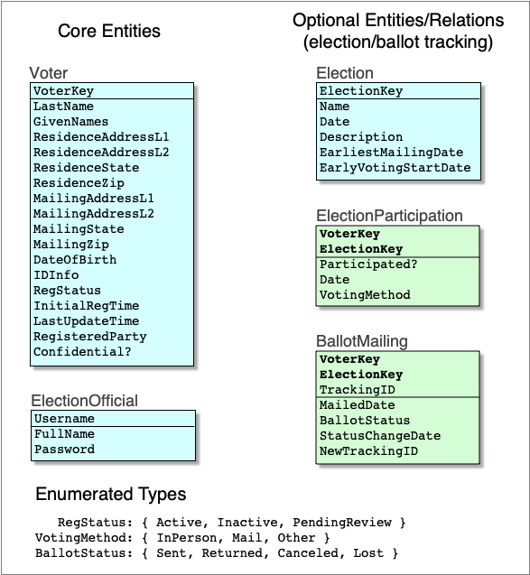

Design of the BESSPIN Voter Registration System
===

The design of the BESSPIN Voter Registration System (BVRS) is written in Lando,
and its top level is [besspin_voter_registration_system.lando](besspin_voter_registration_system.lando).
[architectural_overview.pdf](architectural_overview.pdf) is a basic architecture diagram
(shown below), and [architectural_overview.graffle](architectural_overview.graffle) is its source document. The Lando specification's top-level file is [besspin_voter_registration_system.lando](besspin_voter_registration_system.lando).

The BVRS stores two (optionally three) main types of data:

- voter data
- election official authentication information
- (optional) election and ballot information

The basic data model is [data_model.pdf](data_model.pdf) (shown below), and [data_model.graffle](data_model.graffle)) is its source document; as is typical for such representations, the fields above the lines comprise the primary key when translated to database tables. 

The database schema is [database_schema.md](database_schema.md).